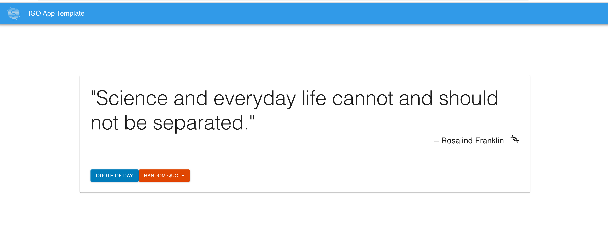

# CCR Pipeline 

## Description
This is a barebones project running RNA-Seq pipeline for CCCR using nextflow. The parameters are lifted from Kids First.

Features Include:
* Aligning using STAR 
* Count file generated from RSEM 

Pull requests welcome!

## Dependencies
- Nextflow
- STAR
- RSEM

## QuickStart

## Please Read Before Deploying
Prior to deploying the application, please modify this template in a few sections so that they are relevant to your environment

## Test run and genome references

----------|---------------|
File      | Location      | 
----------|---------------|
Human     | /etc          | 
Mouse	  | /Mouse        |
----------|---------------|

